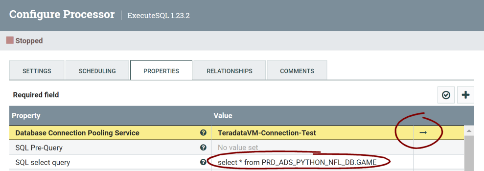

# Connecting Nifi to Teradata

For this demo I will be using a Windows PC including:

- Docker desktop
- PowerShell Core 7.3.6
- VMWare Workstation Player 16
- Teradata Express VM

## Installing Nifi

The easiest way I found to get an instance of Nifi running is using Docker.

To get Docker working on Windows there is a little bit of extra setup required.

[https://docs.docker.com/desktop/install/windows-install/](https://docs.docker.com/desktop/install/windows-install/)

Also, getting WSL2 setup is required for better performance.


[https://hub.docker.com/r/apache/nifi](https://hub.docker.com/r/apache/nifi)

Pull the image.

```ps1
docker pull apache/nifi
```

Run the image (as a container).

```ps1
docker run --name nifi -p 8443:8443 -d apache/nifi:latest
```

Running the container will generate a username and password.

```ps1
docker logs nifi | Select-String -Pattern "Generated"
```

```log
Generated Username [<username>]
Generated Password [<password>]
```

Browse to the service in your browser of choice and login with the Generated credentials.

## Setting up Teradata VM

This is something for another time, and if you are reading this you probably have a large enterprise Teradata instance you want to connect to.

For this demo, the important thing is the IP address of the VM is _192.168.190.128_, you will probably have a hostname for your Teradata instance.


## Adding the Teradata JDBC driver to the Docker container

We need to copy the Teradata JDBC driver to the Docker container and then restart it. Firstly download the JDBC driver and change to the directory in PowerShell.

Then list the containers running.

```ps1
docker ps
```

Get the **CONTAINER ID** from the output.

```log
CONTAINER ID IMAGE              PORTS                  NAMES
81b55e074d9a apache/nifi:latest 0.0.0.0:8443->8443/tcp nifi
```

Replace the **CONTAINER ID**in the following command to copy the driver from your local Windows host to the Docker container.

```ps1
docker cp .\terajdbc4.jar 81b55e074d9a:/opt/nifi/nifi-current/lib
```

## Setting up the FlowFile

Drag a new Processor onto the workbench.

[https://localhost:8443/nifi/](https://localhost:8443/nifi/)


We will select the ExecuteSQL type.


Now, lets configure this new Processor.


Browse to the Properties tab, and add the SQL to select from a table in your Teradata instance. In this case my demo selects from a previous loaded table from another blog post.

```sql
select * from PRD_ADS_PYTHON_NFL_DB.GAME
```

Then click the Arrow to configure the **Database Connection Pooling Service**.



Now, we have a list of Database connections. We need to add or configure one for our Teradata instance (in this case the VM).


```ini
Name=TeradataVM-Connection-Test
Id=87974be0-018a-1000-26db-a45f03ce9a88
Type=DBCPConnectionPool 1.23.2
Bundle=org.apache.nifi - nifi-dbcp-service-nar
SupportsControllerService=DBCPService 1.23.2 from org.apache.nifi - nifi-standard-services-api-nar
BulletinLevel=WARN
```

```ini
DatabaseConnectionURL=jdbc:teradata://192.168.190.128/dbc
DatabaseDriverClassName=com.teradata.jdbc.TeraDriver
```

Then click enable, and if everything is good, you should get an enabled connection.

Now you can run the Flow. I have added a PutFile Processor as well and connected them.


Right clicking on the List queue we can see the queue of resulting SQL queries.


We can see the successful query of the Teradata data in Nifi.


